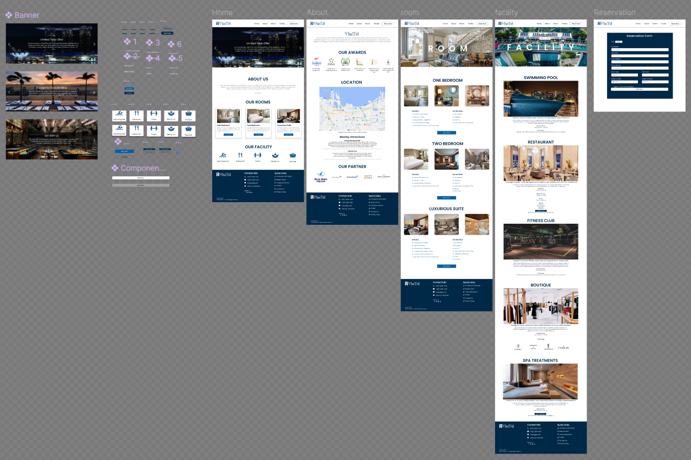

# VhoTel | *HTML, CSS, Javascript, Figma*
- Create a website prototype and company website that represents the VhoTel image.
- Designing website prototype using figma 
(Link: https://www.figma.com/design/pnmEEnZiGxspv1sJ1WTaON/AOL-HCI-LAB?node-id=0-1t=bVooKpG4hE3ehhW3-1)
- Develop responsive website front-end using HTML, CSS, and Javascript

## Figma Design Overview

## Website Overview

#### Home Page
- show the promotion event banners for promotion events that VhoTel is having for its guests

#### About Page
- This page will contain the history, story, and another information of VhoTel so that guests can understand and know more about VhoTel

#### Room Page
- This page will show all types of rooms available in VhoTel such as their picture, and their specifications, so that guests can know details about the rooms in VhoTel

#### Facility Page
- This page will display all the facilities and the information related to the facility provided by VhoTel for guests to enjoy

#### Reservation Page
- This page will contain a reservation form for the guest to book a room in VhoTel. The guest will need to provide details about the reservation and their personal information
